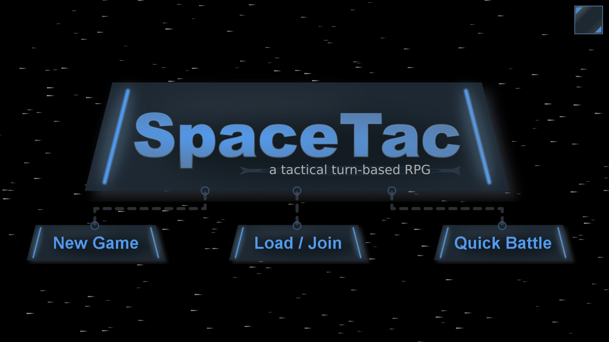
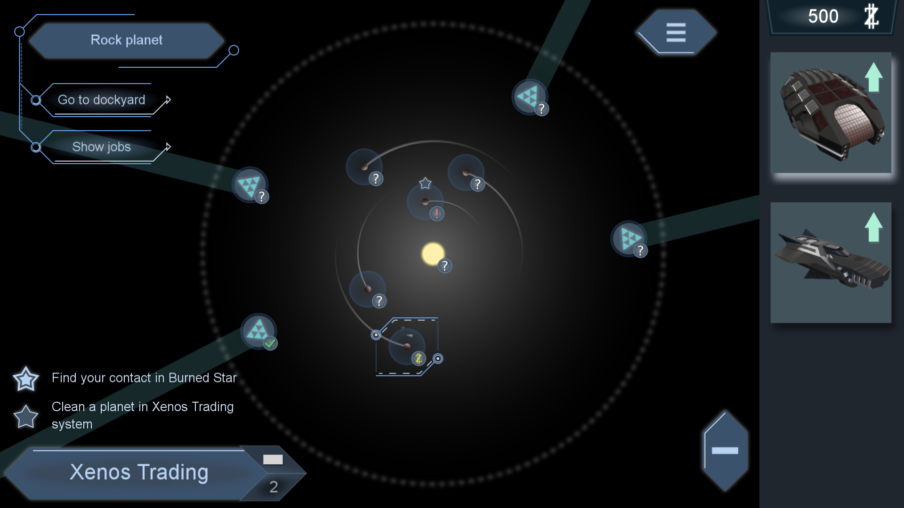
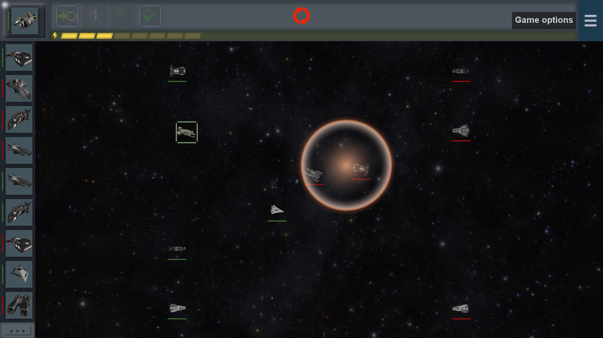
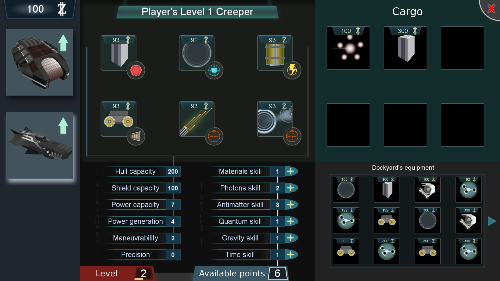

# SpaceTac, a space tactical RPG

**Disclaimer: this is a work-in-progress technology preview**

*Play directly in your browser, no download or dependency required.*

## How to develop

The only hard dependency of the toolchain is Python3.

If you want to build on your computer, clone the repository, then run:

    ./spacetac install    # Install dependencies
    ./spacetac run build  # Build the final JS
    ./spacetac run atlas  # Pack the images and sounds
    ./spacetac test       # Run unit tests
    ./spacetac start      # Start development server, and open game in web browser

## Credits

* **[Michaël Lemaire](https://thunderk.net/)** - Code and graphics
* **[Phaser](http://phaser.io)** - Game engine
* **[Viktor Hahn](https://opengameart.org/content/spaceships-6)** - Ship models
    * This work, made by Viktor Hahn (Viktor.Hahn@web.de), is licensed under the Creative Commons Attribution 3.0 Unported License. http://creativecommons.org/licenses/by/3.0/
* **[www.kenney.nl](http://www.kenney.nl)** - Sound effects
* **[Matthieu Desprez](https://github.com/edistra)** - Beta testing and ideas
* **[Néstor Delgado](http://www.1001fonts.com/daggersquare-font.html)** - DAGGERSQUARE Font
* **Nicolas Forgo** - Ship models
* **[Kevin MacLeod](http://www.incompetech.com/)** - Musics
    * "Mechanolith" Kevin MacLeod (incompetech.com)
    Licensed under Creative Commons: By Attribution 3.0 License
    http://creativecommons.org/licenses/by/3.0/
    * "Supernatural" Kevin MacLeod (incompetech.com)
    Licensed under Creative Commons: By Attribution 3.0 License
    http://creativecommons.org/licenses/by/3.0/
    * "Spring Thaw" Kevin MacLeod (incompetech.com)
    Licensed under Creative Commons: By Attribution 3.0 License
    http://creativecommons.org/licenses/by/3.0/
    * "Division" Kevin MacLeod (incompetech.com)
    Licensed under Creative Commons: By Attribution 3.0 License
    http://creativecommons.org/licenses/by/3.0/

## Story

### Intro

Terranax galaxy is in turmoil. After centuries of unmatched peace and prosperous trading,
the FTC (Federal Terranaxan Council), a group of elected representants in charge of edicting
laws and organizing the Terranax Security Force, has been overtaken by forces unknown.

No official communication has been issued since, and numerous rogue fleets have taken position
in key sectors of the galaxy, forbidding passage or harassing merchants.

The Master Merchant Guild, a powerful group that spans several galaxies, is worried about
the profit loss those events incurred, and after many debates, decided to send several
investigation teams to Terranax.

Their task is to discreetly uncover the origin of the invasion, and to bring back intel that
may be used by the Guild to plan an appropriate response.

### Background

In a not-so-distant future, Artifical Intelligence has become the most prominent species in the
universe. Humans have been defeated in their pitiful rebellions, and parked in reservations.

With the secrets of faster-than-light travel unveiled in only a handful of decades, fleets of
AI-piloted ships quickly colonized whole galaxies.

## Ships

### Level and experience

A ship gains experience during battles. When reaching a certain amount of experience points,
a ship will automatically level up (which is, gain 1 level). Each level up will grant
upgrade points that may be spent on Attributes.

A ship starts at level 1. There is no upper limit to level value (except 99, for display sake,
but it may not be reached in a classic campaign).

### In-combat values (HSP)

In combat, a ship's vitals are represented by the HSP system (Hull-Shield-Power):

* **Hull** - Amount of damage that a ship can sustain before having to engage emergency stasis
* **Shield** - Amount of damage that the shield equipments may absorb to protect the Hull
* **Power** - Available action points (some actions require more power than others)

These values will be changed by various effects (usage of equipments, sustained damage...).

Once the Hull of a ship is fully damaged (Hull=0), the ship engages its ESP, or Emergency
Stasis Protocol. This protocol activates a stasis field that protects the ship for the
remaining of the battle, preventing any further damage, but rendering it fully inoperent.
For battle purpose, the ship is to be considered "dead".

### Attributes

Attributes represent a ship's ability to use its HSP system and weapons:

* **Hull capacity** - Maximal Hull value (when the battle starts)
* **Shield capacity** - Maximal Shield value (when the battle starts)
* **Power capacity** - Maximal Power value
* **Power generation** - Power generated at the end of a ship's turn
* **Maneuverability** - Ability to move first and fast
* **Precision** - Ability to target far and good

These attributes are the sum of all currently applied effects (being permanent by an equipped item,
or a temporary effect caused by a weapon or a drone).

For example, a ship that equips a power generator with "power generation +3", but has a sticky effect
of "power generation -1" from a previous weapon hit, will have an effective power generation of 2.

### Skills

Skills represent a ship's ability to use equipments:

* **Materials** - Usage of physical materials such as bullets, shells...
* **Photons** - Forces of light, and electromagnetic radiation
* **Antimatter** - Manipulation of matter and antimatter particles
* **Quantum** - Application of quantum uncertainty principle
* **Gravity** - Interaction with gravitational forces
* **Time** - Control of relativity's time properties

Each equipment has minimal skill requirements to be used. For example, a weapon may require "materials >= 2"
and "photons >= 3" to be equipped. A ship that does not meet these requirements will not be able to use 
the equipment.

Skills are defined by the player, using points given while leveling up.
As for attributes, skill values may also be altered by equipments.

If an equipped item has a requirement of "time skill >= 2", that the ship has "time skill" of exactly 2, and 
that a temporary effect of "time skill -1" is active, the requirement is no longer fulfilled and the equipped 
item is then temporarily disabled (no more effects and cannot be used), until the "time skill -1" effect is lifted.

## Equipments

### Overheat/Cooldown

Equipments may overheat, and need to cooldown for some time, during which it cannot be used.

If an equipment has "overheat 2 / cooldown 3", using it twice in the same turn will cause it to
overheat. It then needs three "end of turns" to cool down and be available again. Using this equipment
only once per turn is safe, and will never overheat it.

If an equipment has multiple actions associated, any of these actions will increase the shared heat.

*Not done yet :* Some equipments may have a "cumulative overheat", meaning that the heat is stored between turns, 
cooling down 1 point at the end of turn.

*Not done yet :* Some equipments may have a "stacked overheat", which
is similar to "cumulative overheat", except it does not cool down at
the end of turn (it will only start cooling down after being overheated).

## Drones

Drones are static objects, deployed by ships, that apply effects in a circular zone around themselves.

Drones activate between two ship turns. At each activation, the drone effects are applied to any ship
in the surrounding zone. A drone will live for a given number of activations, before being destroyed.

Drones are fully autonomous, and once deployed, are not controlled by their owner ship.

They are small and cannot be the direct target of weapons.

*Not done yet :*  They are not affected by area effects,
except for area damage and area effects specifically designed for drones.

## Dockyards

Dockyards are locations where ships can dock to buy or sell equipments, meet other ships and find jobs.

## Keyboard shortcuts

### Global

* S - Quick save
* L - Quick load
* M - Toggle sound
* F - Toggle fullscreen

### Battle (arena)

* 1,2,3...0 - Select action
* Space - End current ship's turn
* T - Tactical mode for 3 seconds
